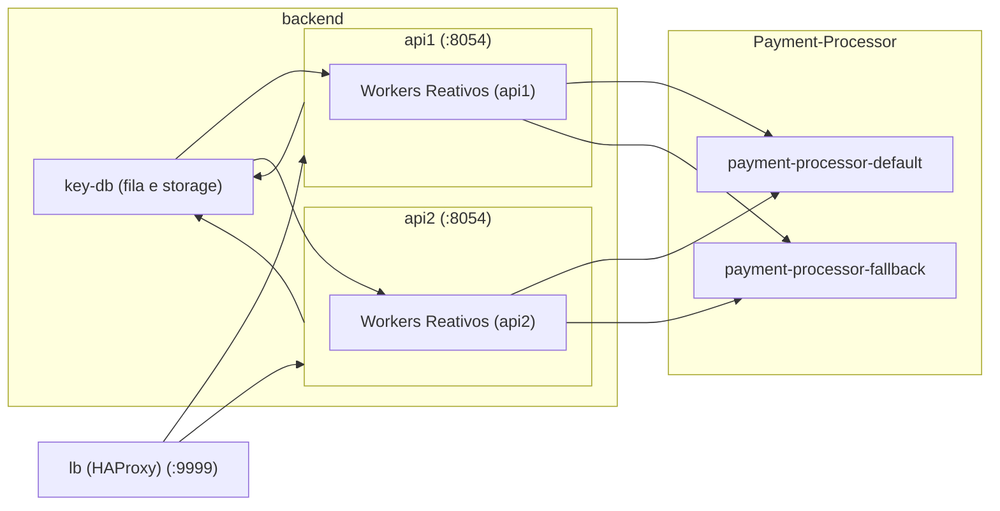

# 🚀Rinha de Backend 2025

Minha submissão super corrida para a rinha 2k25.

## Tecnologias

- ☕ Java (o verdadeiro, ver. 21)
- 🥬 Spring Webflux
- 🍯 KeyDB (3.3-dev)
- 🔄 HAProxy (como load balancer)

## Premissa

O objetivo do projeto é satisfazer o processamento de pagamentos entre APIs default e fallback fornecidas pelo Zan (criador da rinha) com o maior lucro possível. 
O lucro é calculado pela quantidade de pagamentos processados, onde cada pagamento tem um débito da taxa intrínseca da API dos pagamentos, onde a API fallback possui um débito maior que a default (5% para default, 15% para fallback).

## ⚙️ Como subir

Abaixo um exemplo de arquivo `.env` para ser colocado na raíz.

```env
  SPRING_PROFILES_ACTIVE=local
  CONSUMERS_AMOUNT=15
  PIPELINE_POLLING_MS=50
  CONSUMERS_CONCURRENCY_FACTOR=8192
  PAYMENT_PROCESSOR_RESPONSE_TIMEOUT_MS=4000
  CONNECTION_ACQUIRE_TIMEOUT_MS=5000
  MAX_CONNECTIONS=1000
```

Considerações: 
- Qualquer perfil do Spring que não seja `local` necessita de estadia na mesma rede interna Docker dos outros elementos via `docker-compose.yml`;
- Necessita de uma instância de KeyDB em sua porta padrão (`6379`) localmente;
- A única variável ambiente realmente obrigatória é a de perfil do Spring (primeira do .env exemplo);

Com as considerações sendo respeitadas, basta gerar o .jar com o comando `mvn clean package -Pnative` (uma pasta /target na raíz é gerada com o .jar dentro).

Para subida direta a partir do executável gerado nativamente também na pasta /target, execute em bash, na raíz:

```bash
  ./target/rinha-backend-2025 --spring.profiles.active=local
```

## Funcionamento

A arquitetura consiste em utilizar o HAProxy como balanceador de carga para um par de instâncias da API desse projeto, onde por instância o KeyDB é utilizado como fila e mecanismo de persistência (para o endpoint `/payments-summary`).

A ideia central é sempre processar no default, acionando processamento em fallback caso erro no default (inclusive por timeout). Erros de processamento nos dois processadores ocasionam reenfileiramento do payload.

Como ideias de borda, minimizei o peso da imagem Docker usando geração de imagem nativa (roda em GraalVM, quase que obrigatório para um projeto Java devido às restrições da rinha), usei **Java reativo** para tornar a maioria das operações não-bloqueante
e mesmo as operações bloqueantes (integração dos pagamentos em si) recebera uma tratativa usando os recursos do Reactor.

Houve uso de alguns parâmetros de VM onde o principal deles habilita o uso de **Virtual Threads** nos schedulers do reactor para diminuir
o peso das alocações de threads para os processos que são bloqueantes.



## Melhorias a serem consideradas (que não pude implementar pela correria 😢) 

- Uso de Unix Sockets para melhora do processo de delegação dos payloads aos workers e também melhoria da comunicação entre load balancer e APIs;
- Segregação das conexões KeyDB entre leitura (`/payments-summary`) e registro dos pagamentos no ZSET;
- Segregação de uma instância do KeyDB para uso como fila
- Possível criação de uma terceira instância no arquivo compose (depende do footprint de memória das outras instâncias nos testes reais feitos pelo Zan);
- Uso de streams do KeyDB no lugar de lista para enfileiramento.

Obrigado por visitar! 👓
